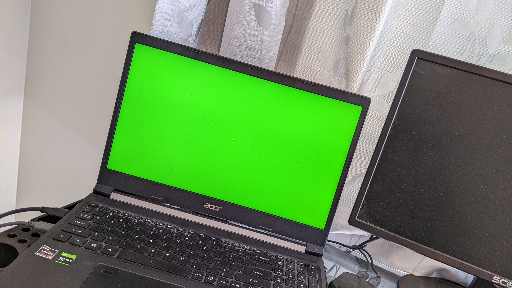

# Image Extraction for the Given Color

Using the test photo here, write a Python 3 script that uses OpenCV to automatically draw a boundary box around the green screen. The script produces a new image that contains only the green screen.


## Quickstart

Tested with Python 3.10 on Ubuntu 22.04

```sh
python3.10 -m venv venv
source ./venv/bin/activate
pip install -r requirements.txt
python extract.py --help
```

It will display the following short help messages.

```
$ python extract.py --help
Usage: extract.py [OPTIONS] INPUT_FNAME

Arguments:
  INPUT_FNAME  [required]

Options:
  --out-fname TEXT  [default: extracted_img.jpg]
  --help            Show this message and exit.
```

Example usage is like this.

```sh
python extract.py --out-fname out.jpg PXL_20230324_025235345.jpg
```

## Result

| Input                                      | Output                     |
| ------------------------------------------ | -------------------------- |
|  | ~[output-image](./out.jpg) |
